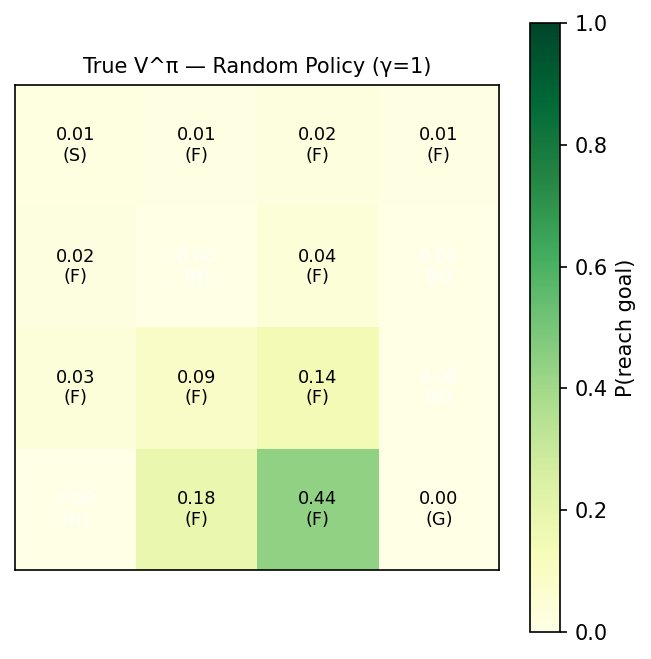
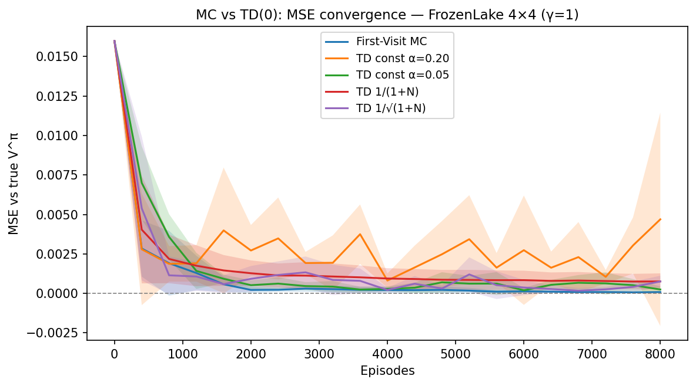
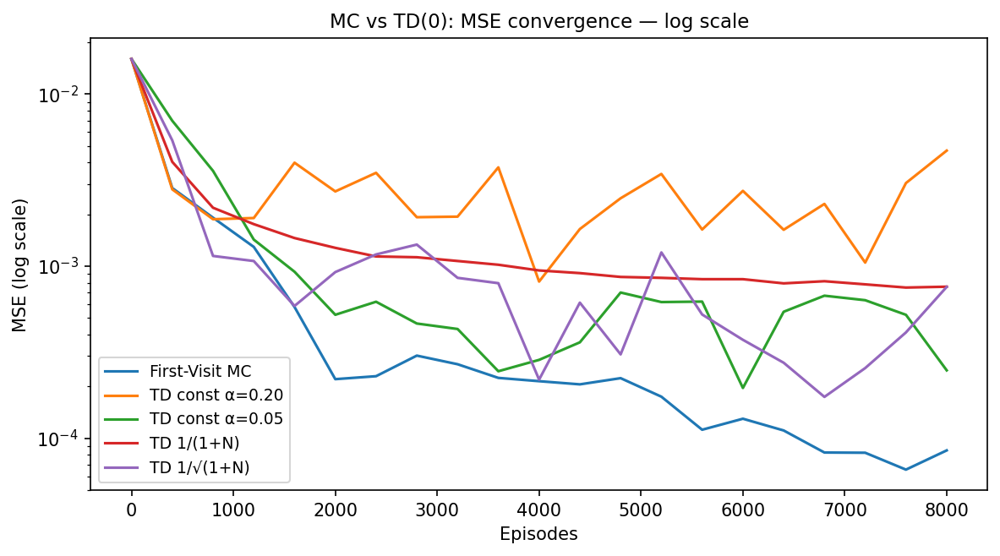
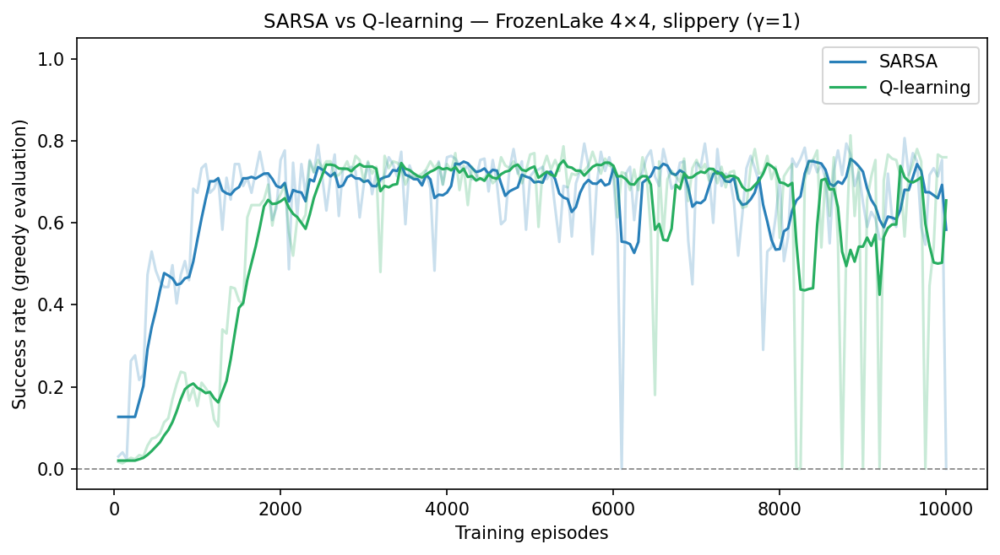
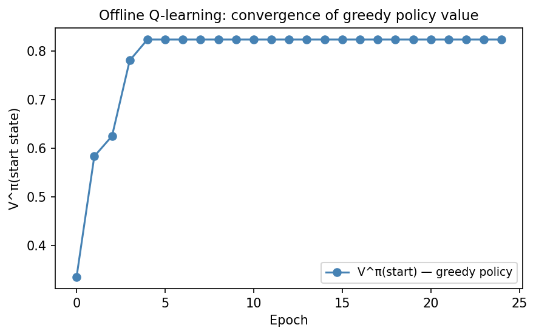
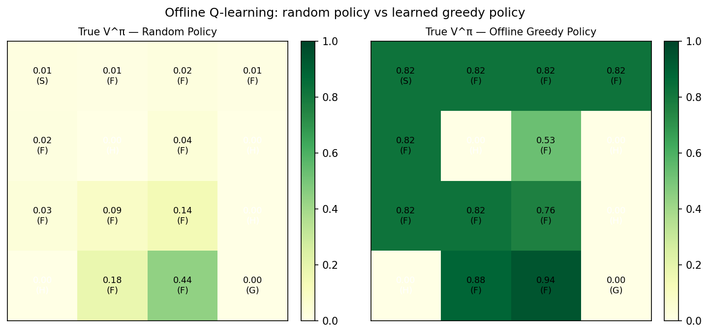

# Reinforcement Learning on FrozenLake: Prediction and Control

Implements and compares core reinforcement learning algorithms on the
FrozenLake-v1 environment — a stochastic navigation problem on slippery ice.

With discount factor γ=1, the value function has an intuitive probabilistic
interpretation: **V^π(s) = P(reach goal before falling | start at s, follow π)**.

---

## Environment

FrozenLake-v1 is a 4×4 grid with four cell types:

| Cell | Meaning |
|---|---|
| S | Start (top-left) |
| F | Frozen — safe ice |
| H | Hole — episode ends, reward 0 |
| G | Goal — episode ends, reward 1 |

**Slippery transitions:** each action moves the intended direction with p=1/3,
or 90° left/right with p=1/3 each. Rewards are sparse: +1 only on reaching G.

---

## Experiments

### 1 — Exact Value Function (Random Policy)

The uniform-random policy reaches the goal with only **1.4% probability** from
the start state. Computed by solving the linear system (I − Q)v = r over
non-terminal states.



### 2 — MC vs TD(0) Prediction

Both methods estimate V^π for the random policy and are compared via MSE
against the exact analytical solution.

| Algorithm | Final MSE (8,000 episodes, 5 trials) |
|---|---|
| TD(0) constant α=0.20 | 0.00469 |
| TD(0) constant α=0.05 | 0.00025 |
| TD(0) inverse 1/(1+N) | 0.00076 |
| TD(0) inverse_sqrt    | 0.00076 |
| **First-Visit MC**    | **0.00008** |

MC achieves the lowest final MSE as an unbiased estimator. Constant-α TD(0)
leaves a noise floor proportional to the step size; diminishing schedules
remove this at the cost of slower early convergence.




### 3 — SARSA vs Q-learning (Control)

Both algorithms use ε-greedy exploration (ε=0.1, α=0.1, 10,000 episodes).
Success rate is evaluated greedily every 50 episodes.

| Algorithm | Final success rate |
|---|---|
| SARSA (on-policy) | ~0% |
| **Q-learning (off-policy)** | **76%** |

SARSA learns the value of the ε-greedy *behavior* policy, which is suboptimal
on slippery FrozenLake. Q-learning directly targets the greedy policy and
converges to a high-performing solution.



### 4 — Offline Q-learning (Batch, Off-policy)

Q-learning learns from a **fixed dataset** of 7,920 transitions collected by
a random behavioral policy — the agent never interacts with the environment
during training.

After 25 epochs over the dataset, the greedy policy achieves
**V^π(start) = 0.82** — compared to 0.014 for the random policy.




---

## Project Structure

```
frozen-lake-rl/
├── environment.py   # env factory, map utilities, exact V^π solvers
├── prediction.py    # First-Visit MC, TD(0) with step-size schedules
├── control.py       # SARSA, Q-learning, offline Q-learning, ε-greedy helpers
├── visualize.py     # value grids, MSE curves, success rate plots
├── main.py          # runs all experiments, saves results/
├── requirements.txt
└── notebooks/
    └── frozen_lake_rl.ipynb
```

---

## Getting Started

```bash
git clone https://github.com/PrashantSU/frozen-lake-rl
cd frozen-lake-rl
pip install -r requirements.txt
python main.py
```

---

## Key Findings

**Prediction:** First-Visit MC is the most accurate predictor at convergence
(MSE = 8×10⁻⁵). TD(0) with a constant step size leaves a noise floor; diminishing
schedules (1/N, 1/√N) reduce this but converge more slowly in early episodes.

**Control:** Q-learning (off-policy) dramatically outperforms SARSA (on-policy)
on this environment. SARSA optimises the ε-greedy behavior value — which
accounts for future random exploration — and therefore remains overly
conservative on slippery ice. Q-learning targets the greedy value directly.

**Offline learning:** Q-learning's off-policy nature allows it to recover a
near-optimal policy (76%+ success rate) from data generated entirely by a
random behavioral policy — no environment interaction during training.

---

## References

- Sutton, R. S., & Barto, A. G. (2018). *Reinforcement Learning: An Introduction* (2nd ed.). MIT Press.
- Watkins, C. J. C. H., & Dayan, P. (1992). Q-learning. *Machine Learning*, 8, 279–292.
- Brockman, G. et al. (2016). *OpenAI Gym.* arXiv:1606.01540.
